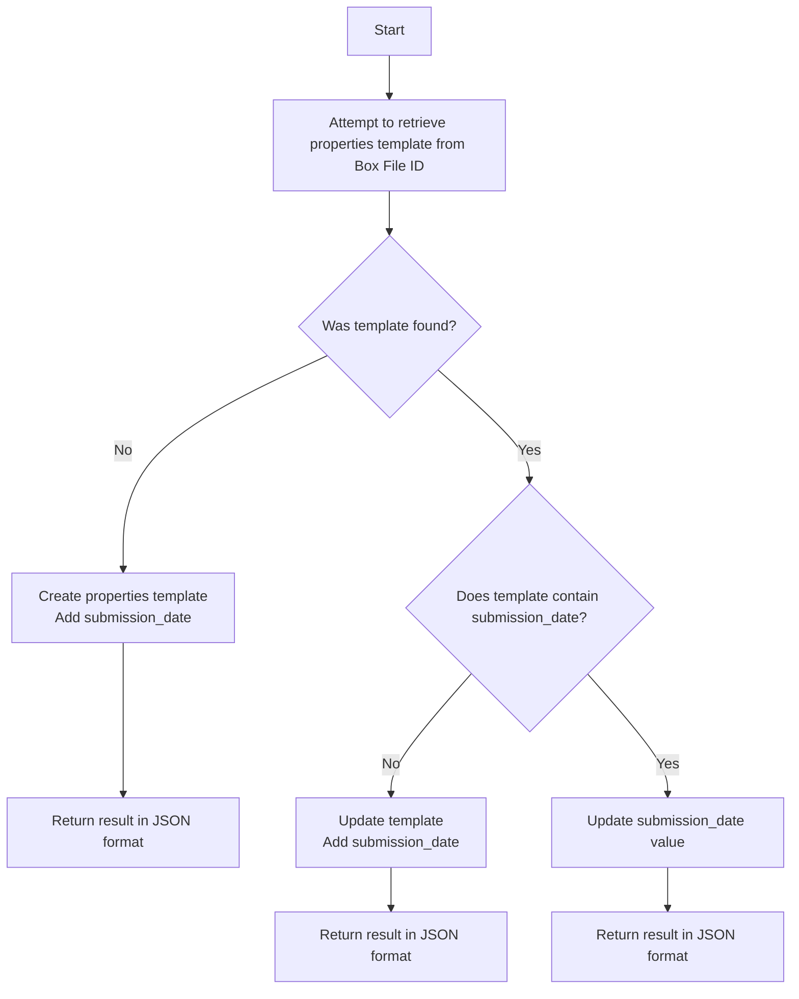

# Overview

The Submission Date Endponts illustrate manipulation of metadata templates instances on files using the Box API
and Box Node SDK.  For this demonstration, the `global` Box metadata template `properties` and the 
template properties key `submissionDate` is manipulated.  Rather than requesting a value for `submissonDate` 
from the caller the current date in [RFC 3339](https://www.ietf.org/rfc/rfc3339.txt) format.

## Function Specs

The following Lamba functions are implemented.  All Lambda functions are access via `GET`.  NBox File IDs are specified as URL path parameters.  For testing use the BOX_TEST_FILE_ID in the [.env](.env) file.  

### Get Submission Date

This function attempts to retrieve the value of submission date from the specifcied file ID.  If the properties tempate is not found (Box API returns an http status code of `404`) return a `404`.  If the properties template is 
found on the file return a `404`.  Otherwise return the JSON representation of the properties template.

### Set the Submission Date

This function will set the submission date on the specificied Box file ID.  It uses the Box file metadata APIs file metatata retrieval, creatiion, and updates as appropriate.  Logic is a follows.

Step 1 - Attempt to retrieve the properties template from the Box File ID 
Step 2 - If not found - Create the properties template with the submission date and return the result in JSON format. Step 3 - If the template was found but does not contain the submission date perform update the template by adding the submission data and returning the result in JSON format. 
Step 4 - If the template was found and does contain a submission date value update the submission date and return the value.

